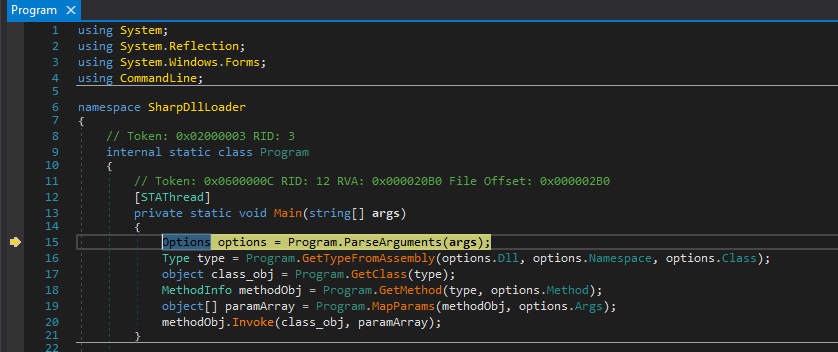

# SharpDllLoader
A simple C# executable that invokes an arbitrary method of an arbitrary C# DLL. **The project is useful to analyze malicious C# DLL through the popular tool dnSpy.** dnSpy does not allow to native debug a DLL because of the absence of a standard entrypoint. So you can debug the SharpDllLoader executable with proper parameters to jump into the specified method of the DLL that you want dynamically analyze.

## Usage

`SharpDllLoader.exe -d DLL_PATH [-n NAMESPACE] -c DLL_CLASS -m METHOD [-a "ARG1 ARG2"]`

`-n` and `-a ` parameters are optional. 

## Example of usage
Analyzing a malware you are faced with a DLL written in C# easily inspectable using some common tools like dnSpy. You know that the malware invokes (i.e. through a previous Powershell stage) the method `Bypass` of the class `Amsi`, but you're not able to debug the method to undestand what it does.
So, open SharpDllLoader.exe in your dnSpy instance, insert the correct parameters into Arguments field and select `Stop At: Entrypoint`.

This is the entrypoint of the exe.

Set a breakpoint on the illustrated instruction, or step over using F10 until you reach this instruction. Then click F11 to step into the invocation.

F11 again

Now click F10

And again F10 until you reach the return instruction (illustrated). Then F11

The same story: click F10 until the return instruction, then F11

Finally you are in the desired method, you can proceed with debug as you know how.

